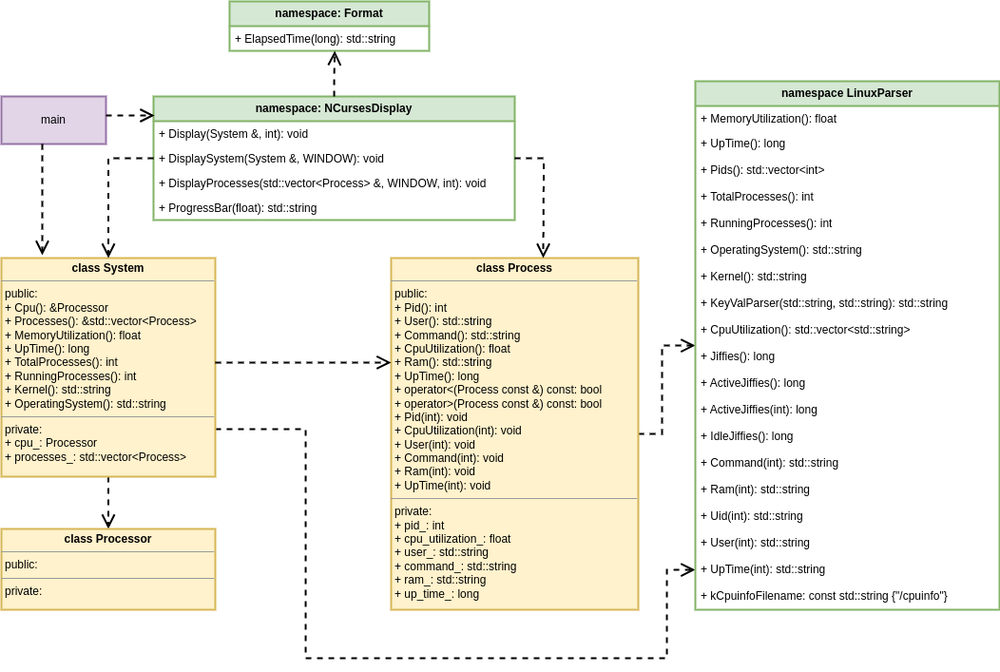

# System Monitor

## Architecture

The software structure and the dependencies between the system monitor's components are shown in the diagram below.

## Instructions

1. Clone the project repository

2. Build the project: `make build`

3. Run the resulting executable: `./build/monitor`

